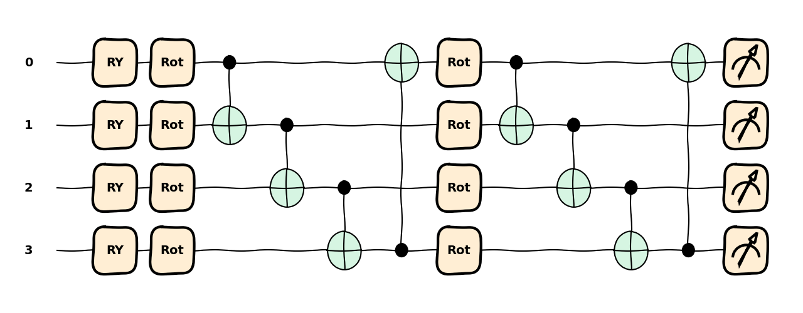
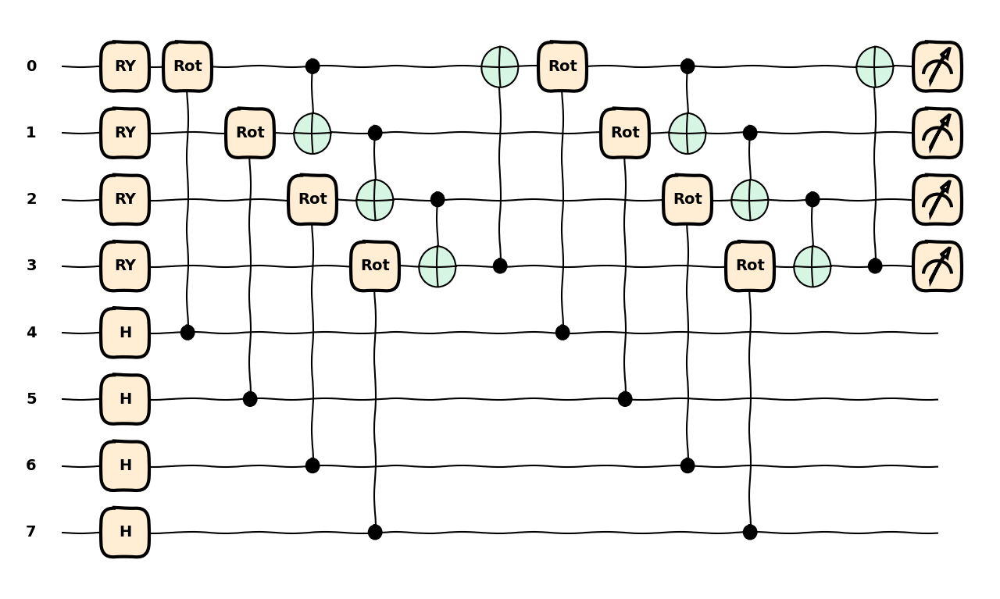
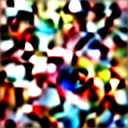
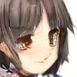
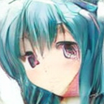

# Quantum-Latent Diffusion Model for Anime Generation

A hybrid quantum-classical generative framework that integrates **Parametric Quantum Circuits (PQC)** into the Transformer blocks of a Latent Diffusion Model (LDM). This project explores the representation power of 16-qubit quantum states in the latent space of anime facial features.

## 🚀 Key Architectures

* **Quantum FeedForward (Q-FFN)**: A novel FFN layer where a 16-qubit PQC acts as a non-linear feature extractor alongside classical GELU layers.
* **Latent Diffusion**: Operates in the VAE-compressed latent space ($z$) to reduce quantum simulation overhead.
* **Conditioning**: Leverages **Google T5** for high-dimensional text embedding injection via Cross-Attention.
* **Stability**: Implements **EMA (Exponential Moving Average)** and **Gradient Checkpointing** to manage the complexity of quantum-classical backpropagation.

---

## 🔬 Quantum Circuit Architecture

The core innovation of this model lies in the `QuantumFeedForward` module. The transition of features from the classical domain to the quantum Hilbert space follows the methodology established in my previous research:

> **Reference:** *https://doi.org/10.1103/PhysRevA.111.022426*

The feature transformation $\mathcal{F}: \mathbb{R}^d \rightarrow \mathbb{R}^d$ is defined by:

$$|\psi\rangle = U_{PQC}(\theta) \cdot \text{Encoder}(\mathbf{x}) |0\rangle^{\otimes 16}$$

### Feature Evolution & Avoiding Barren Plateau Structure

In this implementation, the input tensor classical latent features is mapped to output tensor through the following PQC structure:

<div align="center">



<p><b>Figure 1:</b> Visualization of feature mapping using xxxx (PRA Conclusion Logic)</p>
</div>

* **Encoder**: Non-linear phase encoding using $\text{arctan}(\cdot)$ to map values into $[-\pi/2, \pi/2]$.
* **PQC**: We've found that by using an ancilla qubit to entangle with the rotation gate, this design can prevent gradient vanishing as the number of qubits grows.
* **Gate**: A learnable scalar $\lambda$ controls the quantum contribution: $y = \text{Classical}(x) + \lambda \cdot \text{Quantum}(x)$.

---

## 🎨 Training Progress & Sampling

The model was trained on **60,000+ anime face images** for **20 epochs**. The following samples demonstrate the denoising evolution facilitated by the hybrid quantum-classical U-Net.

### Generative Evolution

| Epoch 1 | Epoch 10 | Epoch 20 (Final) |
| --- | --- | --- |
|  |  |  |
| *Initial Noise / Quantum Chaos* | *Structural Emergence* | *Refined Anime Synthesis* |

---

## 🛠️ Installation & Usage

1. **Environment**:
```bash
pip install torch diffusers transformers pennylane

```


2. **Training**:
```bash
python train.py --use_quantum True --n_qubits 16

```


---

## 📈 Summary of Results

By embedding the 16-qubit PQC into the bottleneck of the `SpatialTransformer`, the model exhibits unique gradient flow characteristics. Preliminary results suggest that the quantum layer aids in capturing high-frequency textures in anime art styles that are often smoothed out by purely classical downsampling.
